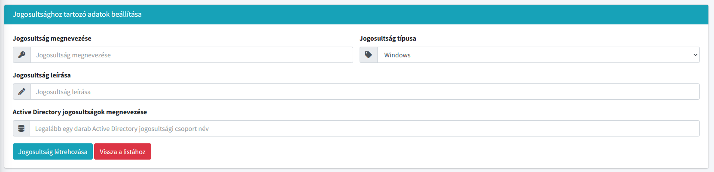
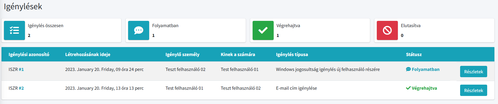



  

# Informatikai Szolgálati jegy Rendszer

Az **ISZR** egy ASP.NET MVC-el készült web alkalmazás amely segítsévégel a felhasználók jogosultságokat igényelhetnek, illetve kamerafelvételek lementését kérhetik a helyi Informatikai osztálytól.

> Az alkalmazás egy **fix** tartományi rendszerhez készült, így azon kivüli használata nem 100%-os. (pl. Administrátori felület)

## Jellemzők

- Reszponzív felület
- Administrátori felület csak ".admin" végződésű admin felhasználóknak
- Regisztráció mentes, Intranet elven műkődik
- Első bejelentkezéskor a felhasználó beállítja elérhetőségeit és már használható is
- Igénylések státuszait a felhasználók követni tudják
- Az adatbázis segítségével egyszerűen lehet elvenni és hozzáadni jogosultságokat
- Egyszerübb (copy-paste) technikával hozzáadható az elfogadott jogosultság a felhasználó részére

## Egyszerű- barátságos környezet

Minden felület színes illetve könnyen érthető ikonokkal van ellátva.

## Igénylések

A felhasználók követni tudják a maguk illetve mások által kért igényléseket.

> Minden igénylést csak az **adminisztrátorok tudnak** jováhagyni illetve elutasítani.