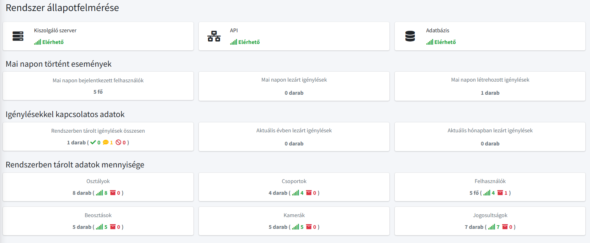



  

# Informatikai Szolgálati jegy Rendszer

Röviden **ISZR**, egy **C# nyelven** készült **ASP.NET MVC keretrendszerű web alkalmazás** amely segítsévégel a felhasználók jogosultságokat, kamerafelvételek lementéseket igényelhetnek a helyi Informatikai csoporttól.

A web alkalmazás célja, hogy a felhasználók egyszerűen, könnyedén igényelhessenek és az igénylések folyamatát is követni tudják.

## Jellemzők

- Reszponzív felület
- Regisztráció mentes, Intranet elven műkődik
- Első bejelentkezéskor a felhasználó beállítja elérhetőségeit és már használható is
- Igénylések státuszait a felhasználók és ügyintézők követni tudják
- Külön adminisztrativ felület rendszer karbantartóknak
- Az adatbázis segítségével egyszerűen lehet elvenni és hozzáadni jogosultságokat a rendszerhez

## Felhasználói típusok

### Sima felhasználók

  

A sima felhasználók csak a számukra igényelt igényléseket látják. Más felhasználók igényléseit nem látják, és nem is képesek igényléseket létrehozni.

Az igénylések megtekintésén kivül képesek még a saját elérhetőségüket, adataikat átírni és képesek még a rendszerben nem archivált jogosultságokat megtekinteni.

### Ügyintézők

  

Az ügyintézők az összes igénylést látják amenyek a rendszerben találhatóak. Ezen kivül csak ők képesek igényléseket lérehozni maguk vagy más felhasználók részére.

### Adminisztrátorok

  

Adminisztrátori jogosultsággal az igénylések státuszait képesek módosítani, valamint csak ők képesek létrehozni (regisztráción kivül) új felhasználókat, osztályokat, csoportokat, beosztásokat, jogosultságokat, kamerákat.

Részükre egy teljesen elkülönített felület látható, bármikor képesek az igénylő rendszerbe és az admin felület között mozogni. Valamint ki lett alakítva egy rendszerállapotot összegző felület, ahol könnyedén megtudhatják, a rendszerrel kapcsolatos fontosabb információkat.
