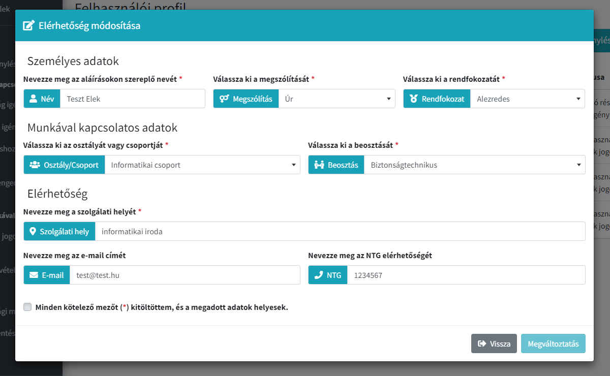

  

# Informatikai Szolgálati jegy Rendszer

Röviden **ISZR**, egy **C# nyelven** készült **ASP.NET MVC keretrendszerű web alkalmazás** amely segítsévégel a felhasználók jogosultságokat, kamerafelvételek lementéseket igényelhetnek a helyi Informatikai csoporttól.

A web alkalmazás célja, hogy a felhasználók egyszerűen, könnyedén igényelhessenek és az igénylések folyamatát is követni tudják.

## Jellemzők

- Reszponzív felület
- Regisztráció mentes, Intranet elven műkődik
- Első bejelentkezéskor a felhasználó beállítja elérhetőségeit és már használható is
- Elérhetőség változtatása bármikor bármire
- Igénylések státuszait a felhasználók és ügyintézők követni tudják
- Külön adminisztrativ felület rendszer karbantartóknak
- Az adatbázis segítségével egyszerűen lehet elvenni és hozzáadni jogosultságokat a rendszerhez
- Könnyen áttekinthető és értelmezhető igénylési lap
- Hivatkozásokkal ellátott igénylési lapok és listák
- Nyomtatható igénylési és jogosultsági listák

## Felhasználói típusok

### Sima felhasználók

	

A sima felhasználók **csak a számukra igényelt** igényléseket látják. Más felhasználók igényléseit nem látják, és nem is képesek igényléseket létrehozni.

Az igénylések megtekintésén kivül képesek még a saját elérhetőségüket, adataikat átírni és képesek még a rendszerben nem archivált jogosultságokat megtekinteni.

### Ügyintézők

	

Az ügyintézők az összes igénylést látják amenyek a rendszerben találhatóak. Ezen kivül csak **ők képesek igényléseket lérehozni** maguk vagy más felhasználók részére.

	

Továbbá az írányítópulton láthatják a saját igényléseinek statisztikáját is.

### Adminisztrátorok

	
	

Adminisztrátori jogosultsággal az igénylések státuszait képesek módosítani, valamint csak ők képesek létrehozni (regisztráción kivül) új felhasználókat, osztályokat, csoportokat, beosztásokat, jogosultságokat, kamerákat.

Részükre egy teljesen elkülönített felület látható, bármikor képesek az igénylő rendszerbe és az admin felület között mozogni. Valamint ki lett alakítva egy rendszerállapotot összegző felület, ahol könnyedén megtudhatják, a rendszerrel kapcsolatos fontosabb információkat.

## Felhasználók adatainak karbantartása

	

Minden felhasználó képes a saját adatait módosítani, így amennyiben az elérhetősége vagy bármely más változik azt tudja változtatni.

A felhasználókon kivül az adminisztrátorok képesek minden felhasználó adatait megváltoztatni.

## Hivatkozások használata

	
	

Minden igénylési lapon és listán az azonosító számok hivatkozásokkal vannak ellátva, ennek segítségével gyorsabban megnyítható az aktuális igénylés.

Nem kell keresni, szimplán csak rá kell kattintani az azonosító számra és már meg is jelenik az igénylés az alkalmazásban.

## Exportálható listák

	

Minden leszűrt igénylési listát vagy jogosultsági listát a felhasználók kitudnak nyomtani.
