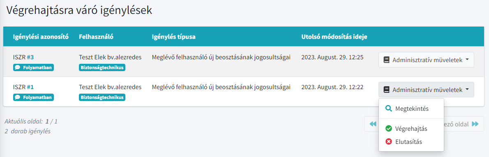
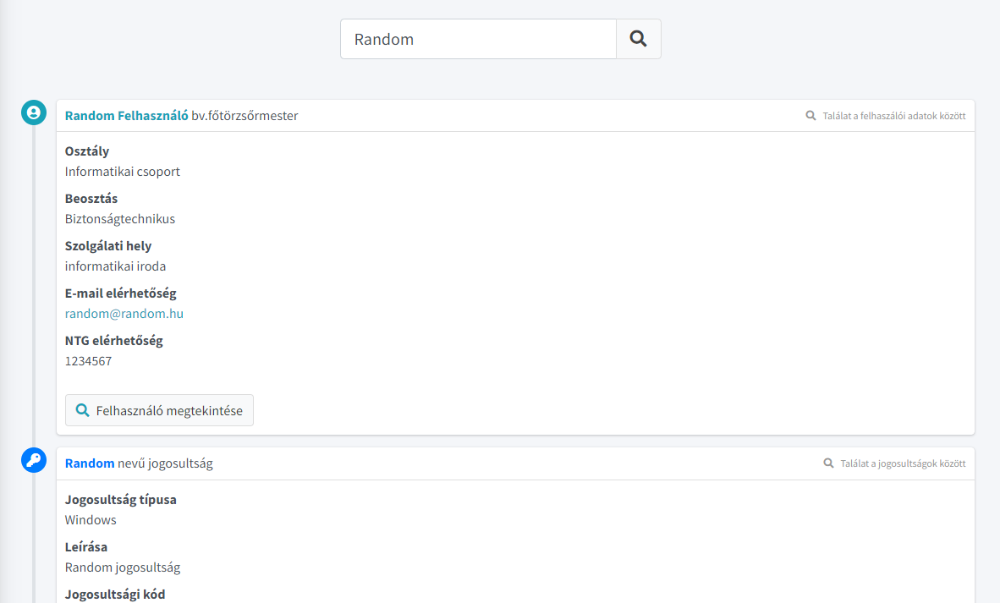
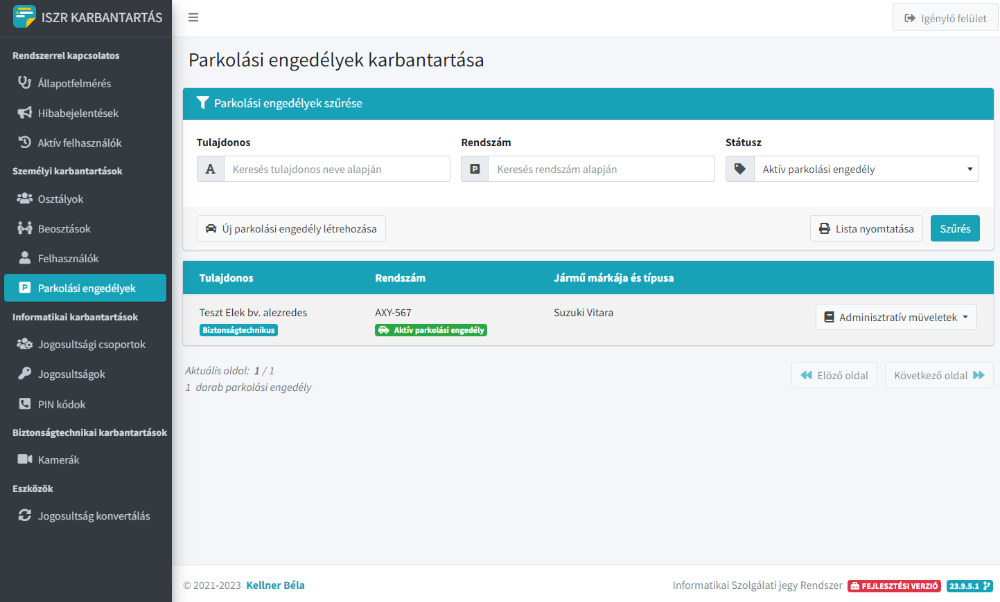
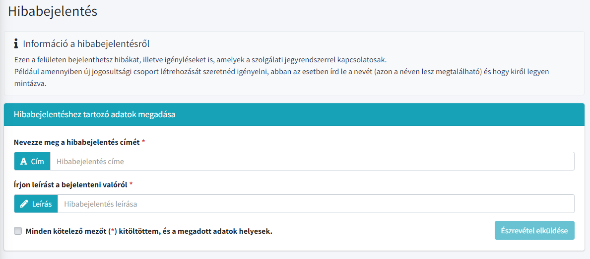
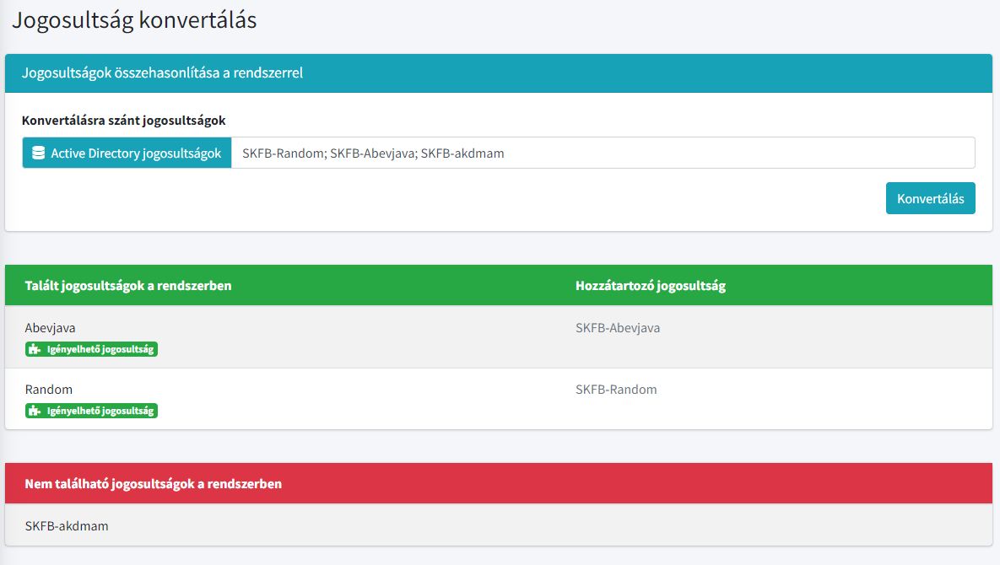
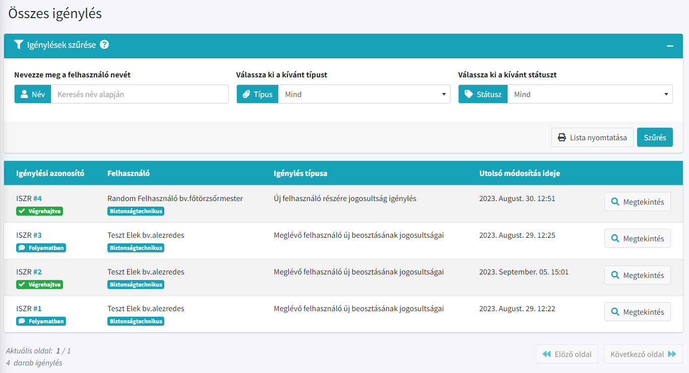
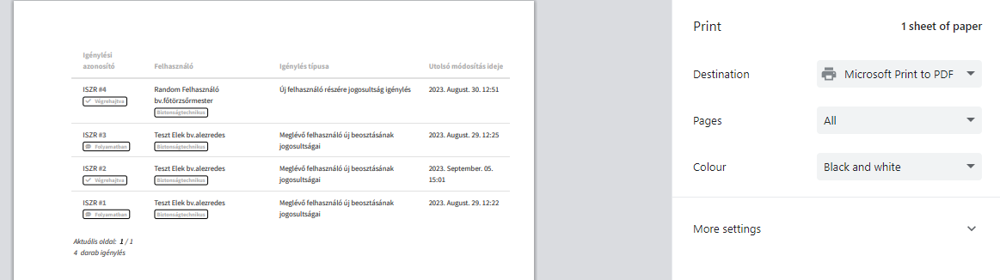

  

# Informatikai Szolgálati jegy Rendszer

Röviden **ISZR**, egy **C# nyelven** készült **ASP.NET CORE 6 MVC keretrendszerű web alkalmazás** amely segítségével a felhasználók jogosultságokat, kamerafelvétel lementéseket igényelhetnek a helyi informatikai csoporttól.

A web alkalmazás célja, hogy a felhasználók egyszerűen, könnyedén igényelhessenek és az igénylések állapotát is követni tudják.

## Jellemzők

- Reszponzív felület
- Regisztráció mentes, Intranet elven működik
- Felhasználói profilok, amik tartalmaznak minden elérhetőséget
- Igénylések státuszait a felhasználók és ügyintézők követni tudják
- Könnyen áttekinthető és értelmezhető igénylési lap
- Hivatkozásokkal ellátott igénylési lapok és listák
- Globális keresés
- Automatikus elérhetőség figyelés
- Külön adminisztratív felület rendszer
- Microsoft SQL Server segítségével minden megjelenített adat dinamikus
- Egyhelyen kezelhető parkolási engedélyek és telefonos PIN kódok dinamikus kezelése
- Beépített hibabejelentő rendszer
- Active Directory jogosultság konvertáló

## Felhasználói típusok

### Sima felhasználók

	

A sima felhasználók **csak a számukra kért** igényléseket látják és nem képesek igényléseket létrehozni.

Az igénylések megtekintésén kívül képesek még a saját elérhetőségüket átírni és a rendszerben nem archivált, azaz igényelhető jogosultságokat megtekinteni

### Ügyintézők

	

Az ügyintézők az összes igénylést látják, amelyek a rendszerben találhatóak. Ezen kívül csak **ők képesek igényléseket létrehozni** maguk vagy más felhasználók részére.

Ezeken felül csak ők tudnak hibabejelentéseket küldeni az adminisztrátorok felé, illetve számukra létre lett hozva egy GYIK menüpont, ahol például az iktatással kapcsolatos kérdésekre megtalálják a választ.

### Adminisztrátorok

	

Az adminisztrátorok részére az alap felületen megtalálható egy Végrehajtásra váró felület is, ahol látják a jelenleg folyamatban lévő igényléseket. Ezen a felületen csak ők képesen azok állapotát megváltoztatni.

	

Az igénylés állapotának megváltoztatásával azonnal megjelenik mindenki számára az igénylés új állapota.

	

Adminisztrátorok részére készült egy teljesen elkülönített felület, ahol bármikor képesek új jogosultságot, osztály vagy bármit létrehozni/módosítani, vagy archiválni.
Valamint ki lett alakítva egy rendszerállapotot összegző felület, ahol könnyedén megtudhatják, a rendszerrel kapcsolatos fontosabb információkat.

## Felhasználók adatainak karbantartása

	

Minden felhasználó csak a saját profilját képes módosítani, ez alól csak az ügyintézők a kivételek, akik képesek bárki más adatait, illetve elérhetőségét módosítani.

## Globális keresés

	

Ügyintézők képesek egy helyen mindenre rákeresni amire szeretnének. Ezen a felület a személyektől egészen a jogosultságokig minden megjelenik.

## Felhasználói profilok

	

Globális keresőt használva az ügyintézők egy helyen láthatják egy felhasználóval kapcsolatos fontosabb adatokat, illetve képesek a felhasználó elérhetőségét is módosítani.

## Parkolási engedélyek és telefonos PIN kódok dinamikus kezelése

	

Adminisztrátorok egy helyen kezelhetik az intézet összes parkolási engedélyei, illetve telefonos PIN kódjait, nem kell létrehozni különféle excel táblázatokat.

	

Az itt megjelenített adatok szintén teljesen dinamikusak, azaz, ha kérnek egy felhasználó részére PIN kódot vagy parkolási engedélyt a rendszer automatikusan létrehozza azt és a felhasználóhoz köti.

## Automatikus elérhetőség figyelés

	

Amennyiben valami nem igényelhető mert elfogyott (például az igényelhető telefonos PIN kód), abban az esetben a rendszer értesíti az ügyintézőt, hogy jelenleg nem igényelhet azonban, ha felszabadul akkor elérhetővé válik a felület.

## Hibabejelentések

	

Ügyintézők számára lehetőség nyílik hibákat, illetve igényeket bejelenteni az adminisztrátorok részére.

## Active Directory jogosultság konvertálás

	

Adminisztrátorok Active Directory jogosultságokat képesek egyszerre megkeresni a rendszerben. A rendszer kiírja melyik található meg a rendszerben, milyen néven, illetve melyek azok, amelyek nem találhatóak meg.

## Exportálható listák

	
	

Minden leszűrt igénylési listát vagy jogosultsági listát a felhasználók kitudnak nyomtani.

## Hivatkozások használata

	
	

Minden igénylési lapon és listán az azonosító számok hivatkozásokkal vannak ellátva, ennek segítségével gyorsabban megnyitható az aktuális igénylés.
 
Nem kell keresni, szimplán csak rá kell kattintani az azonosító számra és már meg is jelenik az igénylés az alkalmazásban.
